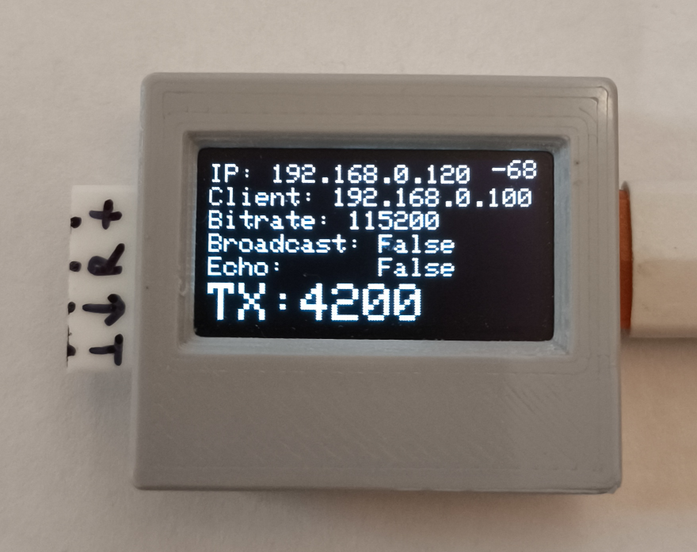

# ESP32-C3 UART to UDP Bridge



Проект для микроконтроллера ESP32-C3, реализующий мост между UART и UDP для беспроводной передачи данных. Устройство принимает данные по UART, упаковывает их в UDP-пакеты и отправляет на указанный IP-адрес или в широковещательный режим.

Существует проблема на платах Super Mini, из-за которой не работает Wi-Fi при мощности выше 8.5 dBm (34) из-за неверной компоновки керамической антенны на плате. Проверяйте максимальную мощность у себя.

3D модели корпуса находятся в папке [3d](../3d)

## Основные возможности

- **UART to UDP**: Прием данных по UART и передача их по UDP на порт 8888
- **WiFi подключение**: Поддержка STA режима с автоматическим переключением на AP при отсутствии сети
- **Настраиваемый дисплей**: OLED дисплей 128x64 для отображения статуса и настроек, поключение SPI
- **Веб-интерфейс**: Настройка параметров через встроенный портал (SettingsGyver)
- **Броадкаст режим**: Возможность отправки данных всем устройствам в сети
- **Эхо режим**: Повтор данных в Serial для отладки
- **Внешний экран**: Поддержка обновления дисплея по UDP (порт 82, 1024 байта)
- **Настройка мощности WiFi**: Управление мощностью передачи для оптимизации энергопотребления
- **Отдельный пин для сброса внешнего устройства**: отправка сигнала 0 длительностью 100мс, общий коллектор (Пока сброс реализован через веб интерфейс)

## Технические характеристики

- **Платформа**: ESP32-C3
- **UART**: Настраиваемая скорость (300 - 4,000,000 бод)
- **UDP порты**:
  - Отправка данных: 8888
  - Прием для дисплея: 82
- **Буфер UART**: 32 KB
- **Дисплей**: SSD1306 128x64 (SPI)

## Схема подключения

```
ESP32-C3     OLED SSD1306
GPIO 6  ---- MOSI
GPIO 4  ---- CLK
GPIO 3  ---- DC
GPIO 1  ---- CS
GPIO 2  ---- RESET

UART (по умолчанию):
GPIO 21 ---- TX
GPIO 20 ---- RX

Сброс свешнего комнтроллера (общий коллектор)
GPIO 9  ---- RESET
```

## Установка и настройка

1. Установите PlatformIO
2. Клонируйте репозиторий
3. Откройте проект в VS Code с PlatformIO
4. Настройте параметры WiFi в `eeprom.h` или через веб-интерфейс
5. Загрузите прошивку на ESP32-C3

## Использование

1. После загрузки устройство попытается подключиться к WiFi
2. Если сеть недоступна, создастся точка доступа "AP ESP32"
3. Подключитесь к точке доступа или используйте IP устройства
4. Откройте браузер и перейдите на IP устройства для настройки
5. Настройте IP клиента, битрейт UART, режимы работы

## Настройки

- **IP клиента**: Адрес получателя UDP пакетов
- **Битрейт UART**: Скорость передачи данных (300-4M бод)
- **Броадкаст**: Отправка всем устройствам в сети
- **Эхо**: Повтор данных в Serial
- **Внешний экран**: Включение приема данных для дисплея по UDP
- **Мощность WiFi**: Уровень мощности передачи (от -1dBm до 19.5dBm)

## Отладка

Устройство выводит подробные логи в Serial (460800 бод):
- Статус подключения WiFi
- Прием и отправка UDP пакетов
- Ошибки чтения UART
- Статистика передачи данных

## Зависимости

- Arduino framework для ESP32
- Adafruit SSD1306
- GyverLibs (SettingsGyver, GyverDBFile, GTimer, StringUtils, mString)

## Версия

Текущая версия: 1.5.5

## Лицензия

MIT License