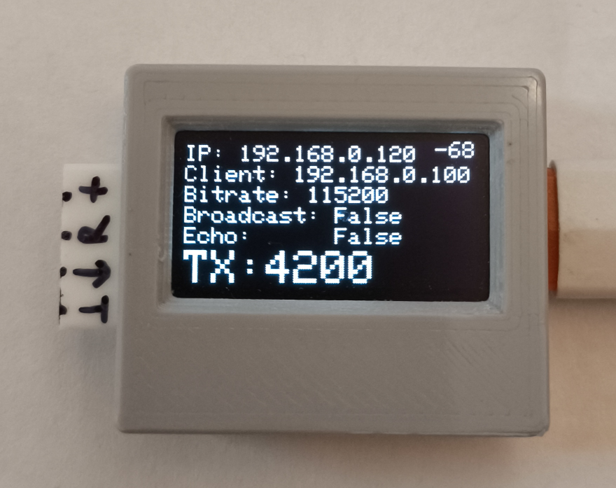

# ESP32 UART to TCP Bridge



Проект превращает ESP32 в мост между UART и сетью.
В обычном режиме ESP32 поднимает TCP server на порту `8888`, а Android
подключается к нему как TCP client и получает байты в том же порядке, как они
пришли из UART.

UDP в проекте оставлен только для двух отдельных задач:

- `broadcast` режим для широковещательной отправки
- внешний экран по UDP на порт `82` при экранной сборке

## Возможности

- передача данных из UART в TCP server на порту `8888`
- Android работает как TCP client и подключается к IP самого ESP32
- режим `broadcast` по UDP на `255.255.255.255:8888`
- защита от переполнения: между UART и сетью стоит ограниченная очередь чанков
- при переполнении новые данные дропаются без краша прошивки
- Wi-Fi в режиме `STA` с автоматическим переходом в `AP`, если сеть недоступна
- опциональная статическая IP-настройка для самого ESP32
- настройка параметров через веб-интерфейс `SettingsGyver`
- опциональный OLED-дисплей `SSD1306 128x64`
- режим `echo` для отладки
- внешний экран по UDP на порт `82` для экранной сборки
- настройка мощности Wi-Fi
- настройка яркости локального OLED через числовое поле `0..255`
- опциональный встроенный статусный светодиод платы
- линия сброса внешнего устройства
- безэкранный вариант сборки через compile-time флаг

## Поддерживаемые платы

### ESP32-C3

- Environment в `PlatformIO`: `esp32-c3-devkitm-1`
- дисплей: `SSD1306 128x64` по `SPI`
- UART:
  - `TX = GPIO21`
  - `RX = GPIO20`
- встроенный статусный светодиод платы: `GPIO8` при сборке с `-DPROJECT_USE_BOARD_LED=1`
- линия сброса внешнего устройства: `GPIO9`

Подключение дисплея:

```text
ESP32-C3     OLED SSD1306
GPIO 6   ->  MOSI
GPIO 4   ->  CLK
GPIO 3   ->  DC
GPIO 1   ->  CS
GPIO 2   ->  RESET
```

### ESP32-S2 Mini

- Environment в `PlatformIO`: `lolin_s2_mini`
- дисплей: `SSD1306 128x64` по `I2C`
- адрес дисплея: `0x3C`
- I2C:
  - `SDA = GPIO18`
  - `SCL = GPIO33`
- UART:
  - `TX = GPIO5`
  - `RX = GPIO3`
- встроенный статусный светодиод платы: `GPIO15` при сборке с `-DPROJECT_USE_BOARD_LED=1`
- при старте:
  - `GPIO35` устанавливается в `HIGH`
  - `GPIO37` устанавливается в `LOW`
- линия сброса внешнего устройства: `GPIO37`

## Архитектура транспорта

### Обычный режим

- ESP32 поднимает `TCP server` на порту `8888`
- Android подключается к IP ESP32 как `TCP client`
- данные из UART уходят в ограниченную очередь чанков
- отдельная `networkTxTask` принимает TCP клиента и последовательно отправляет чанки в сокет

### Broadcast режим

- если включён `broadcast`, UART-данные отправляются по UDP на `255.255.255.255:8888`
- TCP в этот момент не используется для выдачи UART-потока

### Защита от переполнений

Между UART и сетью стоит ограниченная очередь фиксированных чанков.
Это нужно, чтобы медленная сеть не блокировала чтение UART и не приводила к
крашу или неограниченному росту буферов.

Если сеть не успевает:

- уже поставленные чанки сохраняют порядок
- новые данные, которые не помещаются в очередь, дропаются
- количество дропнутых байт видно в логах и на локальном экране

Важно: TCP сохраняет порядок байт, но не сохраняет границы отдельных `write()`.
На Android поток нужно разбирать как непрерывный byte stream.

## Структура проекта

Заголовочные файлы лежат в `include/`, реализации - в `src/`.

Основные модули:

- `include/define.h` - общие define'ы, выбор платы, compile-time флаги
- `include/eeprom.h` - ключи настроек и singleton с инициализацией БД
- `include/network_bridge.h` - публичный интерфейс сетевого модуля
- `src/app_globals.cpp` - общие глобальные объекты проекта
- `src/hardware.cpp` - инициализация пинов, `Serial`, `LittleFS`
- `src/display.cpp` - локальный OLED и экран состояния
- `src/settings_portal.cpp` - веб-портал настроек `SettingsGyver`
- `src/uart_bridge.cpp` - чтение UART и постановка данных в сетевую очередь
- `src/status_led.cpp` - отдельная FreeRTOS задача управления LED
- `src/network/` - сетевые функции в Android-подобном стиле: один `.cpp` = одна функция

Ключевые файлы в `src/network/`:

- `initWiFi.cpp` - подключение Wi-Fi и fallback в `AP`
- `initTcpServer.cpp` - старт TCP server и очереди передачи
- `networkTxTask.cpp` - отдельная задача выдачи чанков в TCP/UDP
- `enqueueNetworkTxData.cpp` - постановка UART-данных в ограниченную очередь
- `pollTcpServer.cpp` - приём входящего Android TCP client
- `sendTcpChunk.cpp` - отправка одного чанка в TCP сокет
- `sendUdpBroadcast.cpp` - broadcast-отправка на `255.255.255.255:8888`
- `sendUdpPacket.cpp` - общая helper-функция UDP отправки
- `initUDP.cpp` - старт UDP на порту `82` только для экранной сборки
- `handleExternalScreenUdp.cpp` - обработка framebuffer для внешнего экрана

## Сборка

Установите `PlatformIO`, откройте проект и выберите нужное окружение.

Сборка для `ESP32-C3`:

```bash
platformio run -e esp32-c3-devkitm-1
```

Сборка для `ESP32-S2 Mini`:

```bash
platformio run -e lolin_s2_mini
```

## Безэкранная сборка

Для варианта без локального OLED добавьте флаг:

```text
-DPROJECT_NO_SCREEN=1
```

в `build_flags` нужного environment в `platformio.ini`.

Что отключается:

- локальный OLED-дисплей
- управление яркостью экрана
- локальный экран состояния
- режим внешнего экрана по UDP
- сервер UDP на порту `82` для внешнего экрана

Остальная логика продолжает работать:

- Wi-Fi
- веб-портал настроек
- UART -> TCP
- `broadcast`
- `echo`
- настройка мощности Wi-Fi

## Светодиод платы

Для включения логики встроенного статусного LED добавьте:

```text
-DPROJECT_USE_BOARD_LED=1
```

Для переопределения полярности:

```text
-DPROJECT_BOARD_LED_ACTIVE_LOW=1
```

или

```text
-DPROJECT_BOARD_LED_ACTIVE_LOW=0
```

Где:

- `1` - светодиод светит при уровне `LOW`
- `0` - светодиод светит при уровне `HIGH`

Для ограничения яркости через PWM:

```text
-DPROJECT_BOARD_LED_BRIGHTNESS=32
```

Диапазон: `0..255`.

Логика LED:

- при старте и подключении к Wi-Fi станции - обычное мигание
- после успешного подключения к `STA` - постоянное свечение
- при сетевой передаче в режиме `STA` - краткий импульс активности
- в режиме точки доступа `AP` - быстрое мигание

LED работает как отдельная FreeRTOS-задача и получает только команды через
`StatusLedCommand`, а не прямое управление пином из разных мест проекта.

## Настройка через портал

Через веб-интерфейс можно задать:

- скорость UART
- режим `broadcast`
- режим `echo`
- параметры Wi-Fi
- использование `DHCP` или `static IP` для ESP32
- статический IP, gateway и subnet mask для ESP32
- мощность Wi-Fi
- яркость локального экрана `0..255` при экранной сборке
- использование внешнего экрана по UDP при экранной сборке

Также через портал доступны:

- перезагрузка ESP32
- аппаратный импульс сброса на внешнее устройство
- очистка базы настроек

## Android

В папке `androidLib/` лежит пример Android-стороны для нового режима на `Ktor`.

Теперь Android не поднимает сервер, а сам подключается к ESP32:

- ESP32 слушает TCP на порту `8888`
- Android запускает `EspTcpBridgeClient`
- в `host` передаётся IP ESP32
- `incomingChunks` нужно обрабатывать как непрерывный поток байт

## Сетевые параметры

- передача данных по TCP: порт `8888`
- передача данных по UDP broadcast: порт `8888`
- внешний экран по UDP: порт `82` только для экранной сборки
- скорость лога в `Serial`: `460800`

## Compile-time tuning

Размер и глубину очереди между UART и сетью можно переопределить:

```text
-DPROJECT_NETWORK_TX_CHUNK_SIZE=1024
-DPROJECT_NETWORK_TX_QUEUE_LENGTH=32
```

По умолчанию:

- размер чанка: `1024` байта
- длина очереди: `32` чанка

## Примечания

- на некоторых мини-платах Wi-Fi может работать нестабильно при мощности выше `8.5 dBm`
- для `ESP32-S2 Mini` дисплей и UART уже разведены на разные пины, чтобы их можно было использовать одновременно
- для внешнего экрана ожидается пакет ровно `1024` байта, это размер framebuffer для `SSD1306 128x64`
- в безэкранной сборке экранный код не просто скрыт в UI, а выключается на этапе компиляции
- ключи `ipClient` и `useTcpTransport` оставлены в БД как legacy, чтобы старые файлы настроек не ломались после обновления

## Зависимости

- Arduino framework для ESP32
- Adafruit SSD1306
- GyverLibs: `SettingsGyver`, `GyverDBFile`, `GTimer`, `StringUtils`, `mString`

## Версия

Текущая версия: `1.6.3`

## Лицензия

MIT
